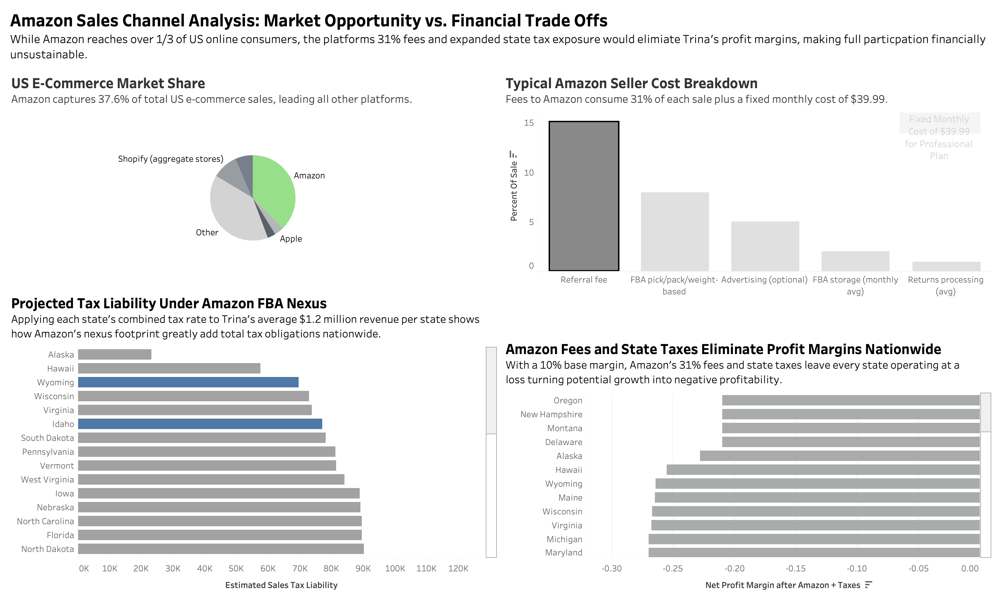
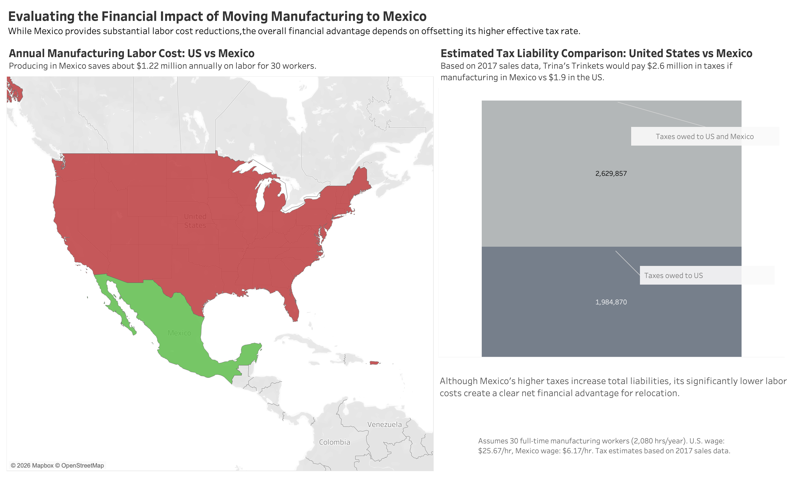

# E-Commerce Sales Tax Nexus & Profitability Dashboard

A preview of the dashboard is shown below.



## Download Tableau Workbook

The full interactive Tableau packaged workbook (.twbx) can be download here

[Download Dashboard](https://drive.google.com/file/d/1bo1A4nJsEl2_j3vtphhoSZHWDBU_3Ayr/view?usp=sharing)

## Project Overview
This project analyzes **Trina’s Trinkets’ 2017 sales data** to evaluate sales tax obligations and profitability across multiple states. The analysis focuses on understanding how the **South Dakota v. Wayfair (2018)** decision impacts tax exposure for an online retailer.

Using **Tableau**, the project explores where Trina currently owes sales tax under **physical nexus rules**, where new **economic nexus obligations** may arise, and how those obligations affect **after-tax profitability**.

The final deliverable is an **interactive Tableau dashboard** that allows users to simulate how changes in tax nexus rules, sales growth, and profit margins influence overall business profitability.

---

## Business Problem
Prior to 2018, businesses were only required to collect sales tax in states where they had **physical nexus** (inventory, offices, or employees).

After the **Wayfair decision**, states were allowed to implement **economic nexus**, meaning tax obligations could arise based on **sales revenue or transaction thresholds**, even without physical presence.

For a growing online retailer like Trina’s Trinkets, this change creates new challenges:

- Identifying where sales tax must be collected
- Understanding how taxes impact profit margins
- Anticipating new obligations as the business grows

This project provides a **data-driven approach** to understanding these challenges.

---

## Project Objectives
The analysis was designed to answer several key questions:

- Where does Trina currently owe sales tax under **physical nexus rules**?
- What is the **effective tax rate** paid across states?
- How do **local tax rates impact profitability**?
- Which **ZIP codes generate the most revenue and profit risk**?
- How would **economic nexus thresholds** change Trina’s tax obligations?
- How sensitive is profit to **sales growth, tax rates, and nexus rules**?

---

## Tableau Dashboard
The dashboards integrate the analysis into an interactive decision-support tool.

The dashboards allow users to:

- Toggle between **physical nexus and economic nexus scenarios**
- Adjust **sales growth assumptions**
- Modify **profit margins**
- Visualize how tax obligations affect **after-tax profit across states**

This tool helps business owners understand how policy changes and growth affect **financial performance and tax exposure**.

---

## Key Analyses

### Sales Tax Owed by State
Identified baseline tax obligations under **physical nexus rules**.  
In 2017, Trina remitted sales tax in:

- Utah
- Washington
- Wyoming

Total tax collected across these states was approximately **$358,000**.

---

### Effective State Tax Rates
The analysis calculated effective tax rates for states with nexus:

- Washington — **9.19%**
- Utah — **6.50%**
- Wyoming — **5.23%**

These states resulted in an **average effective tax rate of 4.66%** across all sales.

---

### Profit Sensitivity to Sales Tax
Further analysis evaluated how sales tax affects profitability across geographic regions and ZIP codes, highlighting areas where:

- High tax rates significantly reduce margins
- High sales volume increases tax exposure
- Future economic nexus thresholds could trigger new obligations

---

## Strategic Expansion & Channel Analysis



Additional analysis evaluated potential strategic growth opportunities and their financial and tax implications.

**Amazon Marketplace:**  
Although Amazon offers access to over one-third of U.S. e-commerce consumers, the platform’s **31% fee structure and nationwide nexus exposure** would eliminate Trina’s profit margins, rendering full participation financially unsustainable.

**Mexico Manufacturing:**  
Producing in Mexico could save approximately **$1.22 million annually in labor costs for 30 workers**, though higher foreign tax rates reduce some of the financial benefit.

These analyses positioned the company to evaluate **operational strategy alongside tax implications**.

---
## Repository Structure
```
E-Commerce Sales Tax Nexus & Profitability Dashboard
│
├── dashboard
│ └── Tableau dashboard file (.twbx)
│
├── images
│ └── Dashboard screenshots and visualizations
│
└── README.md
```

---

## Tools Used

- **Tableau** – Data visualization and dashboard development  
- **Excel/Tableau Prep Builder** – Data preparation and calculations  
- **GitHub** – Project documentation and version control  

---

## Skills Demonstrated

- Data visualization
- Extract, Transform, and Load (ETL)
- Data Cleaning
- Tableau dashboard design
- Sales tax and nexus analysis
- Profitability modeling
- Interactive decision-support analytics
